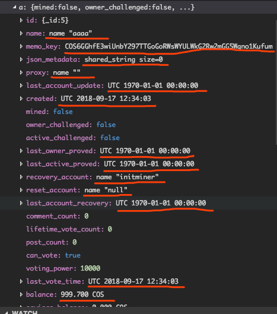
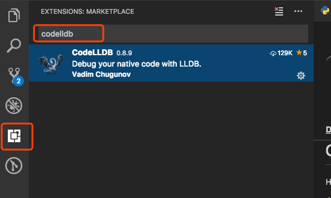
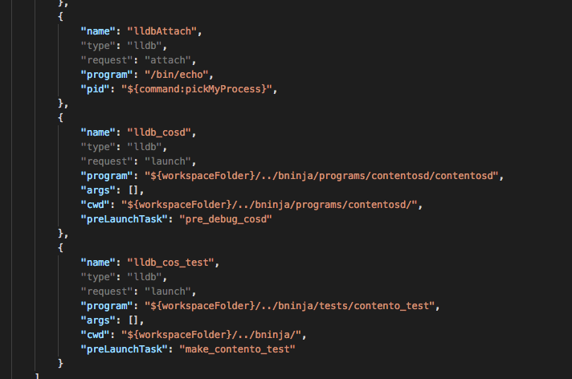
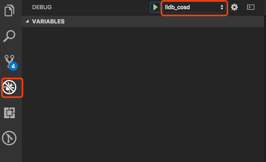

# cos_lldb.py

[/cos_lldb.py](../cos_lldb.py) 是lldb的data formatter脚本，功能：用lldb调试时，对某些class/struct显示更友好的信息。




## 安装

```shell
> python cos_lldb.py
installed to /Users/daishuo/.lldbinit
```

cos_lldb.py 只需安装一次。它是绑定lldb的，只要前端IDE（vscode or xcode）使用lldb调试就有效。


## 目前支持的类

- fc::variant

- fc::variants

- fc::variant_object

- fc::variant_object::entry

- fc::blob

- contento::protocol::asset

- contento::protocol::name

- contento::protocol::namex

- fc::ecc::private_key

- fc::ecc::public_key

- contento::protocol::public_key_type

- contento::protocol::private_key_type

- fc::time_point_sec

- fc::time_point

- contento::chain::shared_string

- chainbase::shared_string


# CodeLLDB extension for VSCode

VSCode的C/C++ extension不是用lldb调试，而是lldb-mi。lldb-mi不会加载~/.lldbinit，cos_lldb.py也就没有用。因此，需要安装CodeLLDB extension，让VSCode用lldb调试。


## 安装




## 配置launch.json

[/scripts/mac-vscode-dev/vscode_build_json/launch.json](../scripts/mac-vscode-dev/vscode_build_json/launch.json) 已经添加了使用CodeLLDB调试的配置，和lldb-mi的配置对应。

直接把json内容替换本地vscode工程的/.vscode/launch.json即可。




## 启动调试

/.vscode/launch.json 更新后，DebugView里面会多出3个“lldb”开头的配置：lldbAttach, lldb_cosd, lldb_cos_test。

选择配置，点启动按钮开始调试。



