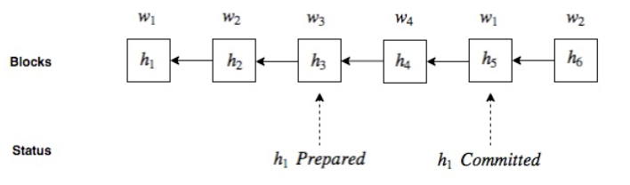
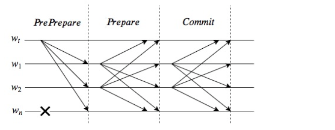

# Contentos技术白皮书

Contentos是一个聚焦于内容服务的区块链系统。系统提供了完善的帐号权限等级和授权管理功能，能够最大程度的保护帐号安全，同时满足灵活的运营需求。内置的经济规则鼓励用户向系统贡献价值内容、加强互动和参与度。在底层区块链共识机制方面，Contentos采用DPoS，相比于PoW大幅提升了TPS。在DPoS基础上，还引入了BFT机制进一步提升服务响应速度，并实现iBFT算法，能够根据系统的动态参数自动适配最佳的共识模式。

Contentos系统提供基于JSON RPC的接口服务，支持前端应用通过HTTP、HTTPS或Web socket接入。系统还提供智能合约功能，允许用户自行开发dApp，最大化的满足个性化需求。为了进一步提升智能合约系统的易用性，Contentos向智能合约开放丰富的API，不仅支持链上数据查询和转账交易，还支持全面的内容管理，以及合约之间的灵活调用。针对常见的用户业务需求，Contentos还提供一批智能合约模版，降低智能合约应用的技术门槛，方便更多用户快速部署。

## 1. 共识机制

### 1.1 设计理念

受制于计算机科学中的CAP理理论： 一个分布式系统最多只能同时满 足 一致性（Consistency）、可用性（Availability）和分区容错性（Partition tolerance）这三项中的两项。Contentos 借鉴了众多公链的底层设计及核心理念，研究显式处理网络分区案，通过优化数据的一致性算法及可用性，取得三者之间的平衡。进而使整个Contentos 网络的效率、 一致性、不可逆性及开放性得到极大提升。基于链的DPoS算法倾向于选择可用性高的而不选择一致性高的，因为可用性高意味着所有的交易都能被处理，不过要以牺牲整个网络中一致性状态复制为代价。基于BFT的却相反，会倾向于选择高一致性。

Contentos基于BFT实现了一种智能的、动态调整的共识算法 iBFT（*Intelligence Byzantine Fault Tolerance*） 。

iBFT共识算法有三种共识模式：

- 线性（Linear）模式 --  大幅降低通信消息，节省网络资源，处理更多的区块链交易；
- 及时（Timely）模式 -- 牺牲一定的网络资源，区块能够比较快的达成共识，进而缩短区块链交易的确认时间；
- 混合（Mixing）模式 -- Contentos 网络能够在比较节省网络资源的情况下保证较短的确认时间，集成两种共识模式的优点；

Contentos的共识模式是组件化设计， 支持热插拔、可定制、可配置为智能动态选择。在智能选择的模式下，智能算法会根据整个 网络的算力、带宽、交易待确认量、 网络拥堵情况等等一系列的因素智能选择最合适的共识模式。

### 1.2 记账人选举规则

Contentos基于DPoS算法，实现了记账 人的公开选举。Contentos 网络中所有持有COS的用户都有权申请竞选记账人，同时所有持有COS的用户有资格投票。每人最多投30票，得票最多的前20个节点负责生产区块，还有一个名额是得票20名以外的节点轮流 生产。这21个节点被称作记账人。 Contentos每3秒产生一个区块，并且在任一时间内仅有一个记账人有权生产区块。每一轮产生21个区块。每轮开始时，根据COS持有者选出新的21个记账人，记账人的生产顺序由2/3或更更多的记账人同意决定。

### 1.3 共识模式设计

在Contentos区块链网络中，共有$n$个记账人，轮询表 $S(w_1 , w_2 , … , w_n )$上的每 一个 $slot$ 就是 一个视图，称之为$s$。另外区块为 $b$, 区块高度为 $h$,  父区块Hash为 $H$ , 第$ i$个记账人节点对区块的签名为 $\langle b \rangle_{σi}$ 。

**Linear共识模式**

1. 在某一 $timestamp$, 记账人$w_1$ 生产高度为 $h_1$ 的区块;

2. 后续记账人继续生产区块 $h_2 , h_3 , h_4 . . .$，每生产一个区块相当于当前记账人对从自己上一次生产区块高度到当前区块高度之间所有区块做了一次确认；注意记账人不对自己生产的区块做确认；
3. 当对某一高度$h_i$ 的区块的确认数达到$ \frac{2}{3} n + 1$时， 高度为$h_i$ 的区块进 入$Prepared$ 状态;
4. 后续记账人继续生产区块, 当$Prepared$ 状态的区块数达到$\frac{2}{3} n + 1$时，按照进入$Prepared$ 状态的顺序排序，前$\frac{1}{3}$ 的区块链进入$Committed$ 状态，成为不可逆区块持久化到区块链数据库中.

假设Contentos网络中有4个记账人：

**Timely共识模式**

1. 在某一$timestamp$，记账人$w_t$ 生产区块 $b$，签名后广播。 预请求消息: $\langle PrePrepare \langle s, b, H, h, \langle b \rangle_{σt}  \rangle$
2. 记账人节点 $w_i$ 第一次收到预请求消息后，验证消息有效性，然后广播准备消息$\langle Prepare \langle s, b, H, h, \langle b \rangle_{σi}  \rangle$ 
3. 当记账人节点 $w_i$ 收集到至少 $2f$ 个其他记账人节点签名的准备消息后，$block$进入$Prepared$ 状态，对所有节点广播确认消息 $\langle Commit \langle s, b, H, h, \langle b \rangle_{σi}  \rangle$
4. 记账人节点 $w_i$ 收集到 $2f$ 个确认消息后，就认为对该区块的共识已经达成 一致，区块进入$Committed$ 状态，并将其持久化到区块链数据库中。

**Mixing共识模式**

1. 在某⼀一 timestamp, 记账⼈人w1 ⽣生产⾼高度为 h1 的区块;
2. 后续记账⼈人继续⽣生产区块h2,h3,h4...，每⽣生产⼀一个区块，当前记账⼈人对从⾃自⼰己上⼀一次⽣生产区块⾼高度的
下⼀一个区块开始到当前区块⾼高度所有区块做⼀一次确认;
3. 当对某⼀一⾼高度hi的区块的确认数达到 2/3n+1 时，⾼高度为hi的区块进⼊入Prepared状态;
4. 当前记账⼈人⼴广播⾼高度为hi的区块的准备消息⟨Commit⟨s,Hi,Hp,h,⟨b⟩σ⟩，所有记账⼈人收到
 ⟨Commit⟩消息后，校验区块，更更改⾼高度为hi 的区块进⼊入Prepared状态，并转发⟨Commit⟩消息; 5. 所有记账⼈人⾄至少收集到2f个确认后，就认为对该区块的共识已经达成⼀一致，区块进⼊入Committed状
  态，并将其持久化到区块链数据库中。

**拜占庭惩罚**

拜占庭问题之所以难解，在于任何时候系统中都可能存在多个提案，并且要完成最终的一致性确认过程十分困难，容易受干扰。而在提案时，记账人付出的成本极低，加剧了恶意拜占庭节点的滋生。 在Contentos 网络中，记账人在出块或者在验证区块时的拜占庭行为很容易被检测。例如（包括但不不限于）:

- 记账人不合法的出块
- 记账人多次无效出块或者没有出块
- 记账人无序的交织出块或者共识投票
- 记账人对同一高度不同区块的重复共识投票

记账人任何无效的行为后，将被Cententos管控，限制其记账权。 除此之外，Contentos引入经济惩罚进一步限制记账人的行为。记账人必须先缴纳保证金才可以参与出块和共识形成。如果一个记账人产生Contentos认为是作恶的行为，保证金将被罚没。保证 金的加入确保了记账人作恶的成本。

## 2. 经济系统

- Contentos 系统内通货标识为 COS，COS 参与一切流通性行为，在目前版本下，流通特指钱包之前的转账行为。
- 持有通货并不会得到额外的权益，如果需要获取系统权利，需要对通货进行冻结，以换取无利率凭据。系统内，该凭据的标识为 VESTS。VESTS 持有的数量直接决定了系统内操作的影响力，比如可以改变奖励池的分配关系。足够的 VESTS 数量也提供了竞选为 Witness 的资格。
- COS 和 VESTS 的比例恒定为 1:1
- Contentos 系统每三秒产生一个新的区块，每个区块产生时，新的 VESTS 将会被追加进奖励池中
- 每个区块产生的 VESTS 数目由数学模型所决定。必要时，所有理事会成员可以通过投票干预模型，以调节新增 VESTS 数目，从而使系统内经济能满足生产力需求
- 所有用户通过参与系统内活动，以从奖励池中分享 VESTS。
- Dapp的开发者会拿到整个奖励池中不多于10%的奖励。
- 目前系统主要活动是“创造内容”，详细来说包括上传视频以及发表评论。其中，前者分享 63% 奖励池中收益，后者分享 13.5% 奖励池的收益。奖励池是累计的，每个新区块产生的时候，会在链上去查找是否有满足奖励结算的对象，如果没有，本次新产生的奖励会累加进奖励池。
- 每个新区块产生奖励的 9% 会直接作为激励进入 Witness 的账户
- 最后 4.5% 的收益结算比较特殊，这部分是对举报的奖励。用户通过抵押一部分 VESTS ，可以对视频或者评论进行举报。举报提交后，会有仲裁者在随后查看是否这是一个有效的举报。如果是，那么抵押的 VESTS 返还，并且从举报奖励池中按照比例分享奖励。如果不是，那么这部分抵押的 VESTS 会加入举报奖励池。举报奖励池不是永久累加的，每 1000 个块会重置掉举报奖励池。如果重置时间点有满足奖励的对象，那么会进行奖励，否则，池中 VESTS 会对半放入创作奖励池和评论奖励池。该机制用来确保“有对举报激励的手段，同时防止投机式举报”。特别的，如果一个视频或者评论已经被仲裁者仲裁过，那么举报请求会直接驳回。
- 创造者和评论者奖励遵循同样的算法，称为”过去窗口权重累计算法“。具体到某个创作品和评论，其在结算时间点分得的 VESTS 数主要由三个因素决定，第一个是当前的“过去积累 rshares ”，第二个是当前奖励池的大小，第三个是该作品的 rshares。
- rshares 用来描述一个作品被投票（点赞）之后获取的权重。该值由两个变量决定，一个是投票用户的 VESTS，一个是该用户的 VOTE POWER。后者由一个复杂的公式计算出来。VESTS 和 VOTE POWER 进行一个计算之后，可以得出该用户的 rshare。而所有对该作品进行投票用户的 rshare 之和，即为 rshares。
- 每当一个作品被结算，其 rshares 会被累加进“过去积累 rshares”，即 `p_rshares` 中。为了防止 `p_rshares` 只增不减，额外规定了 `p_shares` 的衰减函数。准确来说，每一个区块产生的时候，`p_shares` 会衰减掉 `3 / (86400 * 17) p_shares` 的数量。也就是说，某一个 rshares 会持续影响 17 天内的结算。
- 如果已知 `p_shares` , `rewards`, 与一个作品在结算点的 `shares` ，那么该作品作者能得到的奖励为 `shares * (rewards / p_shares)`。
- 特别的，虽然创作品和评论遵循同样的算法，但是其 p_shares 的累计函数并不相同，创作品是简单的线性累计，评论奖励池为平方根算法。
- 每个作品发布到结算的窗口期为 7 天，当前时间 + 7 * 86400 即为结算时间，结算有且只有一次。如果对超过窗口期的作品进行投票，该投票会被直接忽略。
- COS 与 VESTS 可以互相转化。前者到后者的过程称为 Power up，因为权利增加了。反之后者向前者的转化称为 Power down。
- power up 转化是瞬间的，并且可以把自己的 COS 转给别人的 VESTS 账户。
- power down 过程是渐进的，申请提交后，每周可以获取到转化额的 1/13 的部分，13 周才能完整拿到全部 COS。并且只能转化自己的 VESTS 到自己的 COS 账户。每个用户同时只能有一个 power down 请求进行。

## 3. 帐号系统

帐号名是Contentos区块链帐号的唯一标识。有效的帐号名包含3～16个字符，每个字符可以是任意的小写英文字母、阿拉伯数字或句点。长度和字符集的限制条件，几乎不会增加用户选取合适名称的难度，但Contentos系统却可以在工程上大幅降低存储和提高名称查找匹配效率。

### 3.1 权限和授权

Contentos帐号有3个内建的权限等级：Owner，Active，Posting。

- Owner权限：对帐号的绝对控制权，可以进行所有操作。
- Active权限：可以进行除修改帐号信息之外的所有操作。
- Posting权限：只可以进行社交操作，如发表内容或投票，不可以进行转账、买卖等影响帐号资产的操作。

内建权限各自对应一对公私钥。这3对公私钥在帐号创建时产生。用户使用任何一把私钥都可以成功登录，拥有对应的权限等级。例如，使用Posting私钥登录后，只能发表社交内容，无法转账和更改帐号信息。根据PoLP（权限最小化原则），用户使用合适权限的私钥登录，将极大降低帐号的安全风险。在绝大多数使用场景下，都不应该使用Owner私钥登录。

Contentos使用数字签名进行权限鉴定。用户发布一个transaction前，必须用自己的登录私钥对其签名。witness节点在收到transaction后，会首先验证数字签名是否合法，然后检查签名钥匙是否具备执行这个transaction的权限等级。如果检查不通过，transaction将被拒绝执行。

有时，用户会有把自己的权限和一个或多个其他帐号分享——即授权的需求。例如，一个组织O的官方blog有多个维护人员，每人都可以以O的名义发布内容。要实现这个群组blog功能，帐号O需要把它的posting权限授权给一组维护帐号。某个维护人员M发布一篇文章，声明作者是O，并用自己的（M的）私钥签名。Contentos将会检查签名钥匙是否具备O的posting权限，由于它已经授权给M，所以M的签名可以被接受。通过授权的方式，M在不知道O的私钥的情况下，能够以O的身份发布内容。

Contentos帐号权限的授权是始终存在的，默认情况下，Owner/Active/Posting权限分别授权给了对应的帐号公钥，即：只有用户自己拥有这些权限。对于任何一种权限等级，用户都可以更改授权信息，指定一个或多个授权对象。授权对象有2种：

- 其他帐号的公钥
- 其他帐号的用户名和权限

第2种情况有些复杂，但非常灵活。例如，user_a把自己的active权限授权给user_b@active，user_b又把自己的active权限授权给user_c@active。这样就形成了一条授权链。使用active私钥登录的user_c拥有user_a的active权限，虽然user_a没有直接授权给他。Contentos支持授权链的鉴定，但出于性能考虑限制了授权链的最大长度。幸运的是，大多数使用场景不会用到或者只需要很短的授权链。

Contentos还支持对授权对象分配权重，用于更加复杂的授权需求。比如，admin的owner权限授权给3个帐号user_a, user_b, user_c，他们的权重都是0.5，即每个人都只有“一半”权限，需要2个人的共同签名才能使用admin的owner权限。单个授权用户的私钥泄漏，并不会影响admin帐号的安全。这种多用户签名机制，能够大幅降低授权引入的安全风险。

### 3.2 并行权限鉴定

Contentos的帐号授权管理，和基于数字签名的权限鉴定机制，是与上层应用逻辑解耦的，并且是个“只读”过程。即使有些transaction会更改授权信息，改动在block生成之后才能生效。因此，所有transaction的权限鉴定可以并行进行，不必依赖复杂的应用逻辑。而且，p2p节点可以在刚刚接收到transaction时就开始鉴权操作，这些transaction被正式打包到block后需要执行时，不必重新鉴权。

权限鉴定是一个计算密集的过程，需要较多的运算时间。并行化的权限鉴定能够大幅提高Contentos整体的运行效率。

通过replay blocks重新生成区块链状态时，是可以省略权限鉴定的。因为一个合法block包含的所有transaction，在进入block时已经做过权限鉴定。这也可以显著提升replay的速度。

### 3.3 帐号恢复

用户的Owner私钥被盗并被修改时，可以通过Contentos的帐号恢复功能重新找回帐号。用户需要提供最近30天内有效的任何一个Owner私钥，由指定的恢复辅助帐号批准并发起帐号恢复申请，来重置用户帐号的Owner key。所有帐号都有自己的恢复辅助帐号，默认情况下，恢复辅助帐号是用户帐号的创建者。用户可以修改自己的恢复辅助帐号，一般设置成自己信任的好友帐号。

恢复辅助帐号不同于将Owner权限授权给其他帐号，因为恢复辅助帐号只能参与帐号恢复过程，它并没有用户帐号的任何权限，无法以用户身份发起任何transaction。

## 4. 智能合约和虚拟机

**技术背景**

COS智能合约使用C/C++做为主要编程语言，底层采用WebAssembly虚拟机。WebAssembly(WASM)是一个已崭露头角的Web标准，受到Google, Microsoft, Apple及其他大公司的广泛支持。目前为止，最成熟的用于构建应用及WASM代码编译的工具链是CLANG/LLVM及其C/C++编译器。第三方开发的其他工具链包括：Rust，Python和Solidity。虽然这些其他语言看起来可能更简单，但它们的性能可能会影响您可以构建的应用程序的规模。

**合约能力**

用户可以把自己开发的合约预编译成WASM字节码部署到区块链中，Contentos会提供一套API支持合约的外部调用。COS智能合约提供类似以太坊ERC20规范下的开发能力，也可以通过系统提供的API进行发帖，点赞，数据统计等操作。

合约支持热更新，可以帮助用户快速修正BUG。

**合约限制**

考虑到用户使用Contentos区块链服务的公平性，每个用户智能合约执行时长，使用CPU、网络、内存资源都会被限制。

**开发编译**

使用C/C++做为主要编程语言，我们会提供一套封装好的COS C/C++ API支持合约的开发，这套API有更强大的类型安全性，并且更易于使用和阅读。

提供合约编译脚本，可以很方便的编译合约、生成WASM字节码文件和ABI接口文件。

**安全机制**

首先，合约是运行在一个沙箱化的执行环境中。并且WASM通过减少其语义中较为危险的特性并同时保持对C/C++在语法上的最大兼容性来保证一个较高的安全性和可用性。我们在合约运行前，预先对合约本身做严格的权限检查和资源限制，更好的保障安全。

## 5. 虚拟机内容API

除了虚拟机自身的能力之外，contentos的虚拟机还提供足够丰富的原生链的api来帮助内容开发者，这样开发者可以通过编写dApp来实现各种高级的功能。规划中会开放的API包括但不限于以下方面：

- 用户在链上的任何raw操作，譬如：获取个交易的具体内容
- 链上产生的虚拟操作数据，譬如：得到某个时段内witness获得的奖励值
- 向native链提交写操作，譬如：进行发帖或者进行点赞
- 合约之间相互交互的操作，譬如：根据另外一个合约的执行结果来决定本合约的执行流程

**示例**

举一个具体的例子：譬如推广方A需要宣传某款物品，进而和网红B进行合作，和B约定，7天之内如果B创作的宣传视频得到10000人点赞，那么A会给予B 100个COS作为奖励。这样一个流程就可以采用合约API很好的进行实现：

1. 首先A部署合约，将100个COS质押到合约中
2. 当B发完视频后触发合约启动
3. 7天过后，合约自动执行，通过内容api获取到视频的点赞人数，如果结果符合协议，那么调用转账API将COS转入B的账户中，如果不符合协议，则根据合约程序返还给A账户

## 6. 合约模版

目前大部分公链在提供合约功能的同时并没有很好的合约模版和自动化部署合约的功能，这使得普通用户根本无法享受到合约带来的好处。Contentos公链在这个方面会实现的非常易用，公链自身会集成几十种常用的合约，并且为这些合约开发易用的API接口。Dapp的开发者可以提交模版集成建议，在被开发团队采纳后会直接更新到公链的核心代码中。

